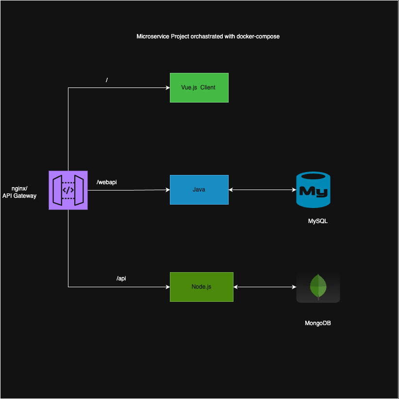

# Microservice Application Orchestrated with Docker Compose

## Overview

This project demonstrates a microservice architecture orchestrated using Docker Compose.

## Architecture

- **Nginx**: Serves as an application gateway, routing requests to individual services.
- **Client Application**: Built with Vue.js.
- **Web API**: Developed with Java and MySQL.
- **API Service**: Built with Node.js and MongoDB.

